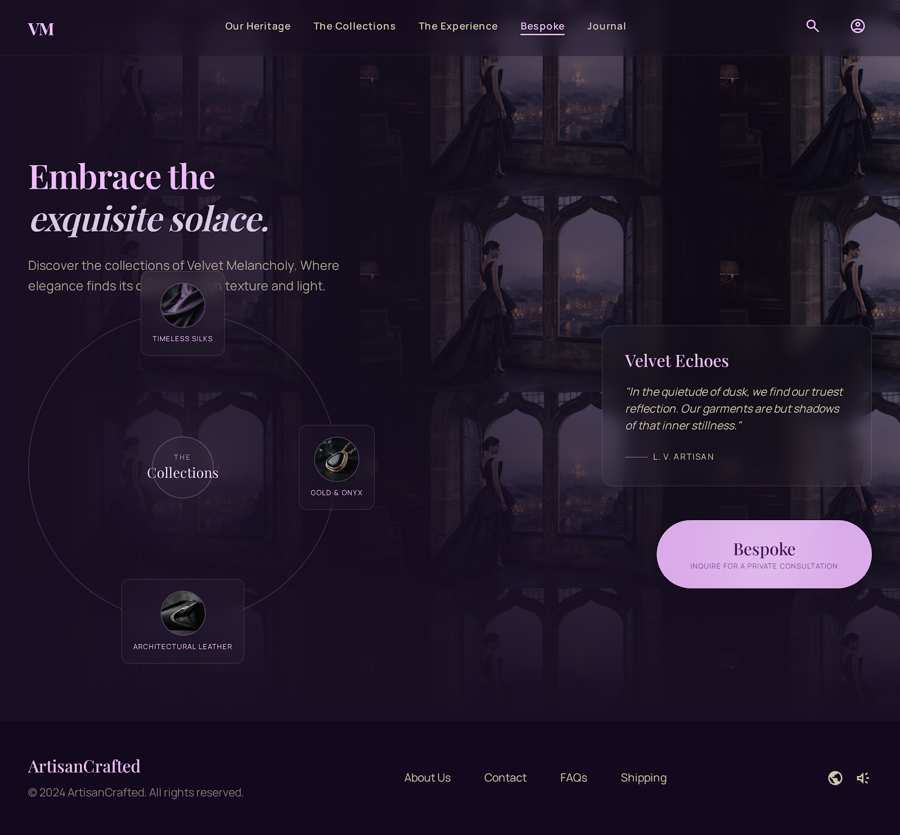
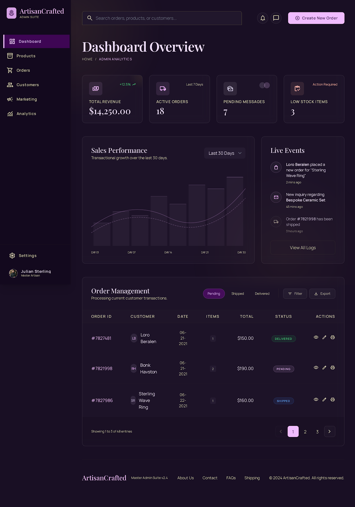
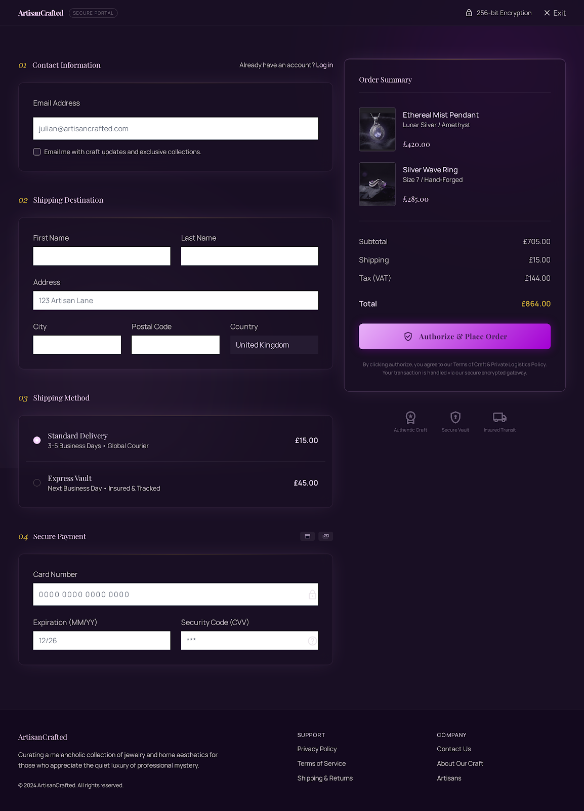
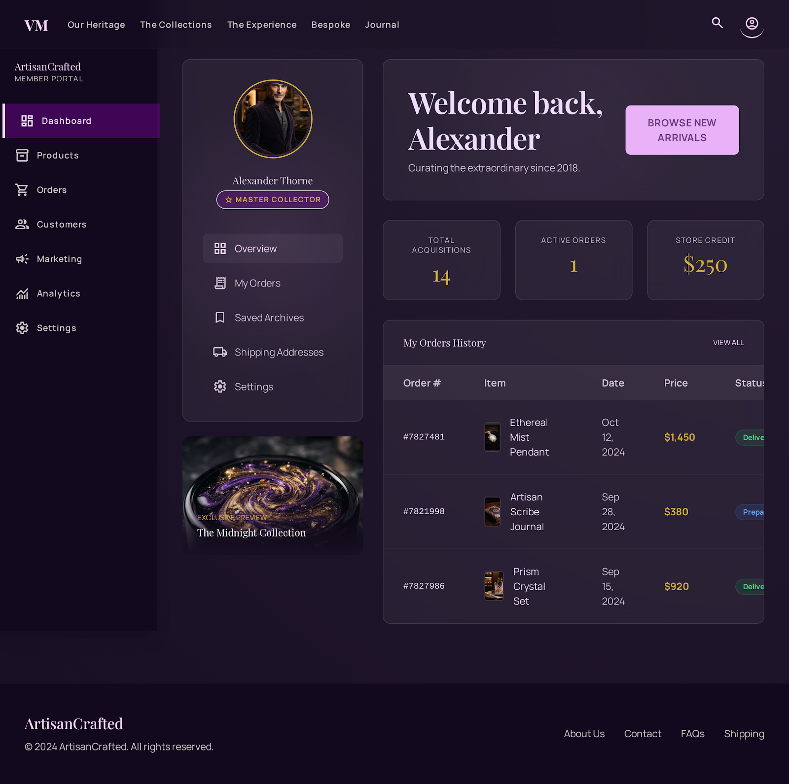

# ArtisanCrafted 🎨


> A premium, full-stack e-commerce platform for luxury handmade goods, featuring a bespoke **Liquid Glass** design system.

---

## ✨ Key Features

- **Immersive Storefront**: Curated collections with a high-end aesthetic.
- **Secure Authentication**: JWT-based sign-in with role-based access control (Admin/Customer).
- **Admin Dashboard**: Full management suite for products, orders, and inventory.
- **Dynamic Cart & Checkout**: Seamless shopping experience with real-time updates.
- **Order Fulfillment**: Track orders from preparation to delivery.
- **Liquid Glass UI**: A custom design system using glassmorphism, atmospheric depth, and orchid-themed palettes.
- **Responsive Design**: Optimized for mobile, tablet, and desktop.

---

## 🛠 Tech Stack

| Layer | Technology |
|-------|------------|
| **Runtime** | Node.js |
| **Framework** | Express.js |
| **Database** | SQLite (via `better-sqlite3`) |
| **Templating** | EJS |
| **Authentication** | JWT + bcryptjs |
| **Styling** | Custom CSS / Liquid Glass System |

---

## 🚀 Installation

Get the project running locally in three steps:

1.  **Clone the repository**
    ```bash
    git clone https://github.com/Chandana-m-p/CodeAlpha_Artisan.git
    cd CodeAlpha_Artisan/artisancrafted
    ```

2.  **Install dependencies**
    ```bash
    npm install
    ```

3.  **Configure Environment**
    Create a `.env` file in the `artisancrafted` directory:
    ```env
    PORT=4000
    JWT_SECRET=your_secret_key_here
    ```

4.  **Seed the Database** (Optional)
    ```bash
    npm run seed
    ```

5.  **Start the Server**
    ```bash
    npm start
    ```

---

## 📖 Usage

Once running, visit **http://localhost:4000** to explore:

- **Home**: Browse the featured collections.
- **Admin**: Access `/admin` to manage the store.
- **Account**: Register or sign in to manage your profile and orders.

---

## 🎨 Design System

This project is built using the **Liquid Glass Luxury** design system.
- **Palette**: Orchid Mist, Electric Violet, and Midnight Violet.
- **Typography**: Playfair Display (Serif) & Manrope (Sans).
- **Style**: Glassmorphism with `backdrop-blur` and atmospheric glows.

---

## 📸 Screenshots

| Feature | Preview |
|---------|---------|
| **Storefront** |  |
| **Admin Suite** |  |
| **Secure Checkout** |  |
| **My Collection** |  |

---

## 🤝 Contributing

Contribations are welcome! Please follow these steps:
1. Fork the repository.
2. Create your feature branch (`git checkout -b feature/AmazingFeature`).
3. Commit your changes (`git commit -m 'Add some AmazingFeature'`).
4. Push to the branch (`git push origin feature/AmazingFeature`).
5. Open a Pull Request.

---

## 📄 License

Distributed under the MIT License. See `LICENSE` for more information.

---

## 📬 Contact

**Chandana M P** - [chandanakargal25@gmail.com]

Project Link: [https://github.com/Chandana-m-p/CodeAlpha_Artisan](https://github.com/Chandana-m-p/CodeAlpha_Artisan)
